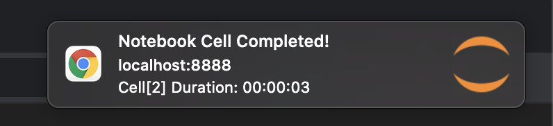
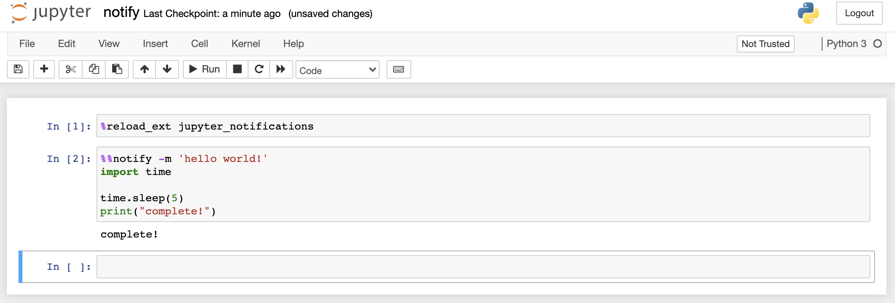

# Jupyter Notifications
Notebook Cell Completion Browser Notifications for Jupyter Notebook and Lab. 




# Features
Cell magic command for notification after cell execution completion.
```
%notify
...some code to execute...
```

Cell magic command with custom message.
```
%notify -m 'hello world!'
...some code to execute...
```
Or
```
%notify --message 'hello world!' 
...some code to execute...
```

# Tutorials
You can find an example notebook in the `examples` folder.




## Installation

Install the package via pip.
```
pip install jupyter_notifications
```
Add the extension in the ipython kernel config's `c.InteractiveShellApp.extensions` section. 
```
~/.ipython/profile_default/ipython_kernel_config.py
...
c.InteractiveShellApp.extensions = [ "jupyter_notifications" ]
```
Then spin up jupyter notebook or lab with 
```
$ jupyter notebook
$ jupyter lab
``` 

## Development

This extension was tested with the Google Chrome browser.
This should work with any browser that has [access to the Notifications API](https://developer.mozilla.org/en-US/docs/Web/API/Notifications_API/Using_the_Notifications_API#browser_compatibility). 

To build the extension locally, run the following command.
```
$ flit install
```

